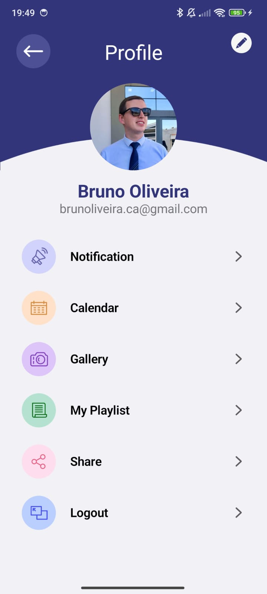

# Profile Screen

I made this project in native Android using Kotlin as the language 🙂 .

The project consists of a user profile screen with the aim of addressing modern concepts of creating layouts using the Compose library, and can be well used, for example, in a personal task management application.

## Print da Tela de Perfil

  

  
### Image Description

The image above shows the application profile screen. Here users can easily access their information.

## How to Run the Application

To run this application, follow the steps below:

1. Clone this repository or download the source code.
2. Open the project in Android Studio.
3. Connect an Android device to your machine or set up an emulator.
4. Click the "Run" button in Android Studio to launch the application.

## Technologies Used

- **Android Studio**: IDE used for application development.
- **Kotlin**: Programming language used to write the application code.
- **Jetpack Compose**: Library for Android applications used to assemble modern layouts.

## License

This project is licensed under the MIT License. See the `LICENSE` file in the project root for more details.
