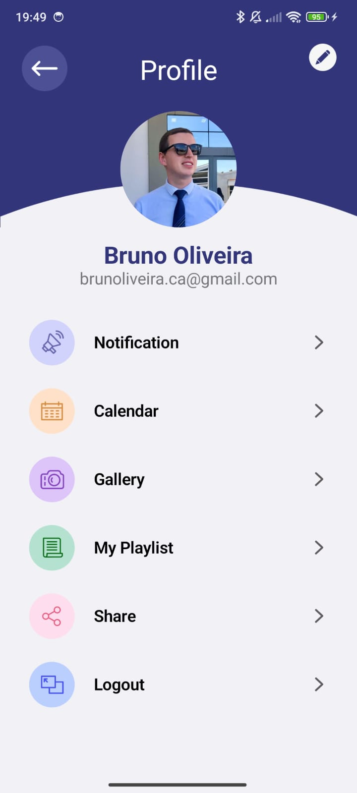

📱 Profile Screen

This is a profile screen project developed with Native Android using the Kotlin language 🙂.

The goal is to demonstrate the creation of modern interfaces with the Jetpack Compose library, simulating a profile screen that could be used, for example, in a personal task management app.

 

🖼️ Screen Screenshot

 

<i>The image above shows the profile screen interface, where the user can easily view their information.</i>

 

▶️ How to Run the Project

 

Follow the steps below to run the application:

    Clone this repository or download the source code.

    Open the project in Android Studio.

    Connect an Android device or start an emulator.

    Click the "Run" button (or press Shift + F10) to launch the app.

 

🛠️ Technologies Used

    Android Studio — IDE used for development

    Kotlin — Programming language

    Jetpack Compose — Modern toolkit for building native Android interfaces

 

📄 License

This project is licensed under the MIT License. See the LICENSE file for more information.

Made with 💙 by BrunOliveiraCA
